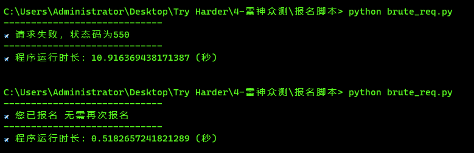

# LS批量请求脚本


#### 1. 手工修改配置

在众测项目发布时间节点前 1-2 minutes 运行：

```python
# 配置雷神众测的项目id值，目前【Vol.397】对应id值为335，依次类推
id = 335
# 配置登录认证成功后的token值,即 Authorization 的值，需要登录手工获取
token = "XXX"
# 配置短时间内想要发包的总包数量，如果要调节单位时间内的并发数量请修改pool值
# 以百度请求为例，3秒可以发100个包，雷神服务器性能肯定更低，大概5000个包就可以了，3分钟之内出现报名成功
# 循环请求总次数num，并发请求次数pool，总的发包数=num*pool
num = 1000
```

修改并发请求数pool：

```python
async def main(url, proxy, params, headers, num, bt):
    tasks = []
    # 限制同时请求的数量pool，可自行调节，默认10个
    pool = 10
```

#### 2.运行

`python brute_req.py`



#### Tips:

A. pool值设置过高会导致网关拒绝请求，1-20 即可

B. 安装模块：`asyncio, aiohttp`

```powershell
python -m pip install asyncio aiohttp -i http://mirrors.aliyun.com/pypi/simple/  --trusted-host mirrors.aliyun.com
```

C.发包失败和报名成功均会自动停止

D.出现异常开启代理调试即可 Proxy

